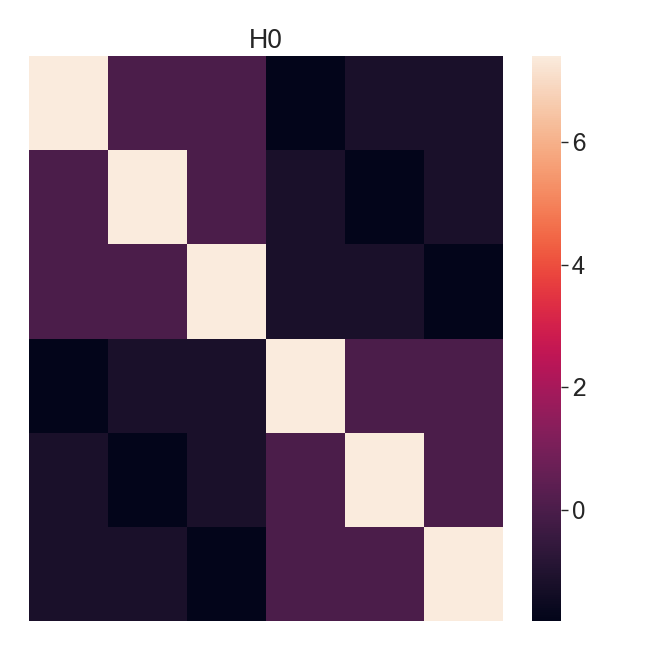
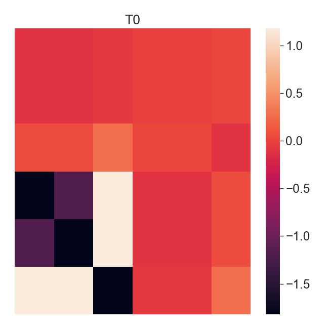
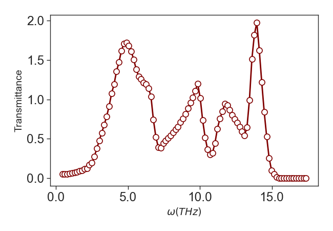
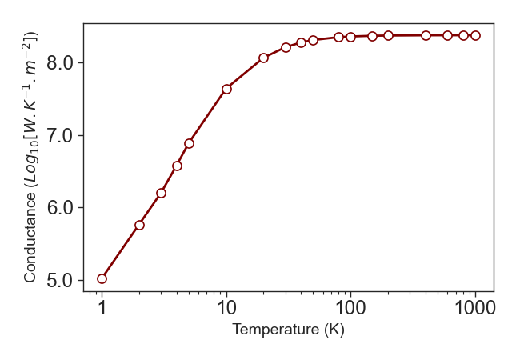
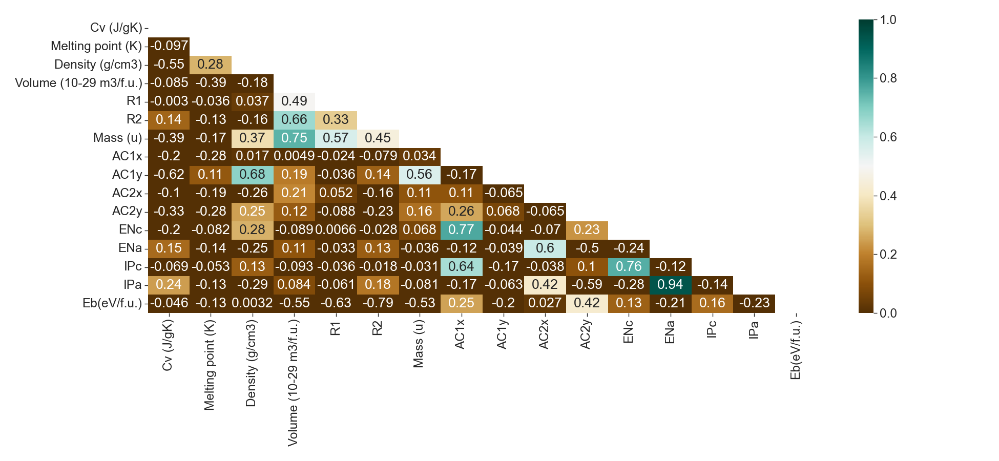
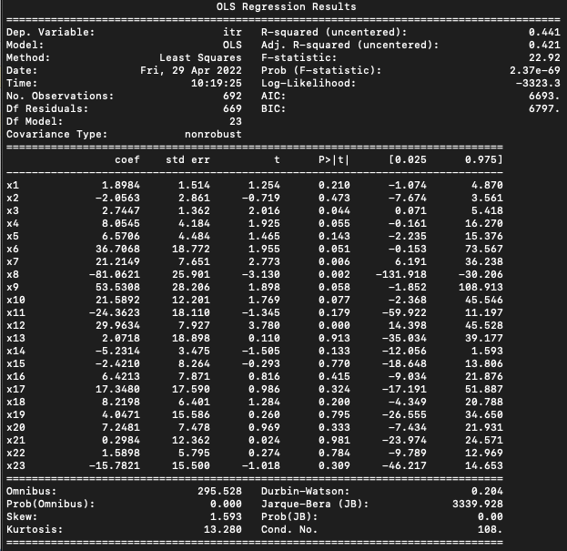
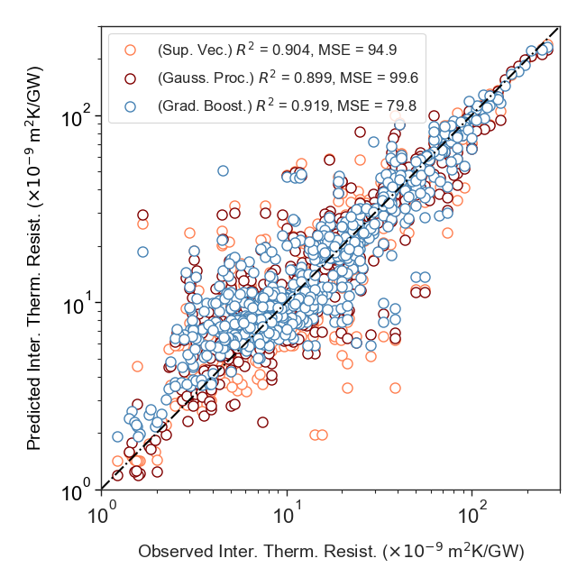

OpenKapitza
==============================
[//]: # (Badges)

A python package to compute anharmonic heat transfer across inhomogeneous interfaces.
### Introduction

Thermal management across interfaces is of increasingly technological importance in variety fields of thermoelectrics, 
nanoelectronics, catalytic cells, optoelectronic devices, 2D electronic devices and nanotheranostics. For example, 
massive interfacial thermal resistance limits the performance and reliability of microelectronic devices because 
shrinking size has led to increased heating. The net thermal conductivity depends on both the scattering/ transmission 
of phonons at interfaces and the ballistic effect between interfaces. Modeling these materials effectively requires 
phonon transport simulation with mesoscale resolution while including atomistic resolution of phonon interactions at 
non-ideal interfaces. OpenKapitza is a NEGFs solver that can be used to model heat transport across inhomogeneous 
interfaces. In practice, OpenKapitza reads the second- and third-order inter-atomic force constants (IFCs) and returns 
the mode-resolved transport coefficients; these coefficients can be used in mesoscale Boltzmann transport solvers to 
accurately simulate the phonon evolution in multi-component structures or to guide experiments on thermal conductivity. 
The development of the OpenKapitza framework started under the 2022 MolSSI Software Fellowship. The workflow includes 
the following main steps: 1) reading the second-order IFCs from molecular dynamics (MD) or density functional theory 
(DFT) solvers, 2) calculating the self-energy terms, the coupled, uncoupled and surface Green's functions, and 3) computing 
the mode-resolved transport coefficients using Caroli formula. These coefficients are combined with the 
Landauer formula to evaluate thermal conductance. The contribution of individual acoustic/optical modes, scattering 
specularity, angular transmission spectrum, and modal transport coefficients (and thus the explicit relation between 
the phonon transmission probability and the phonon dispersion) are computed on the fly. In addition to careful algorithm
developments, the code made use of the hardware-agnostic computational platform JAX to facilitate vectorized linear 
algebra operations on GPUs.

### Interatomic Force Constant

The ratio of interatomic force to that of change in interatomic distance is defined as the interatomic force constant. 
OpenKapitza uses Phonopy/ PhonoLAMMPS FORCE_CONSTANTS output to compute mass-weighted IFCs. The IFCs matrix is then used
to compute the IFCs sub-matrices for the device, left/ right leads. H0-matrix and T1-matrix show the onsite and hopping 
IFCs for the device in bulk Si.

 

 

To model infinitely large IFCs perpendicular to the transport direction, OpenKapitza solves NEGF in Fourier's space. 

### Coherent Phonon Transport in Bulk Materials 

The transmission function shows the total number of phonon modes available at a given frequency. Although the 
transmission function from either side is identical, a requirement of detailed balance, the transmittance has 
directional dependence.

 

The transmission function is used in Landauer Eq. to compute thermal conductance.

 

### Gradient Boost Regression Model of Interfacial Thermal Conductance

The Pearson correlation between materials' properties is shown here.

 

The dataset is from DOI 10.5281/zenodo.3361417. Please consider citing it if you are using OpenKapitza ML models. Here is
the initial statistical evaluation oof the dataset. note that In statistics, the p-value is the probability of obtaining 
results at least as extreme as the observed results of a statistical hypothesis test, assuming that the null hypothesis 
is correct. The p-value serves as an alternative to rejection points to provide the smallest level of significance at which 
the null hypothesis would be rejected. A smaller p-value means that there is stronger evidence in favor of the alternative 
hypothesis.

 

Gradient boosting is a machine learning technique that gives a prediction model in the form of an ensemble of weak 
prediction models. OpenKapitza uses Intel® Extension for Scikit-learn to predict interfacial thermal conductance. 
This is only to accelerate calculations. The model accuracy against support vector machine and Gaussian process is shown here

 

### Copyright

Copyright (c) 2022, Aria Hosseini

#### Acknowledgements
 
Project based on the 
[Computational Molecular Science Python Cookiecutter](https://github.com/molssi/cookiecutter-cms) version 1.6.
# OpenKapitza

